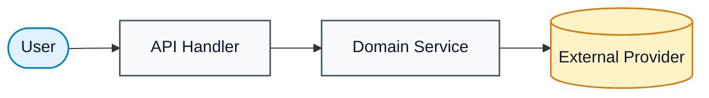
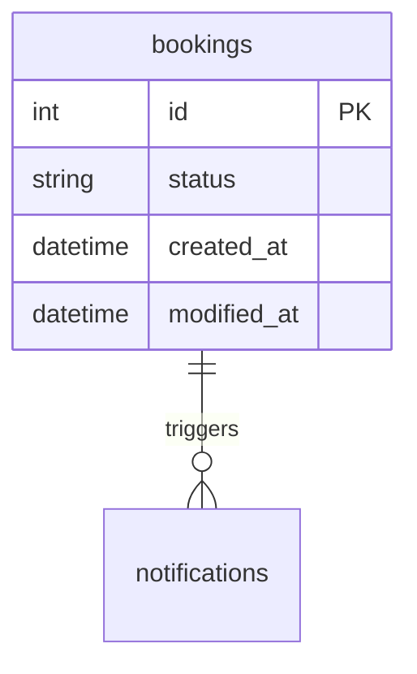

# Mermaid Templates

## High-Contrast Flowchart (`LR` / `TD`)

```mermaid
flowchart LR
    classDef actor fill:#e0f2fe,stroke:#0284c7,color:#0f172a,stroke-width:1.5px
    classDef service fill:#f8fafc,stroke:#475569,color:#0f172a,stroke-width:1.5px
    classDef ext fill:#fef3c7,stroke:#d97706,color:#0f172a,stroke-width:1.5px

    U([User]):::actor --> A[API Handler]:::service
    A --> S[Domain Service]:::service
    S --> E[(External Provider)]:::ext
```

## `erDiagram` Template

```mermaid
erDiagram
    bookings ||--o{ notifications : triggers

    bookings {
        int id PK
        string status
        datetime created_at
        datetime modified_at
    }
```
